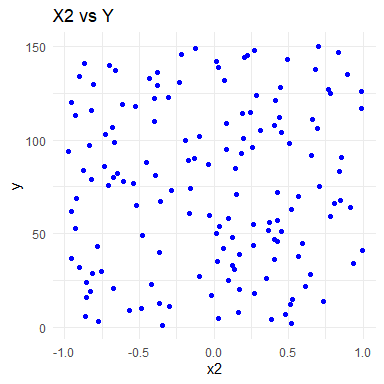
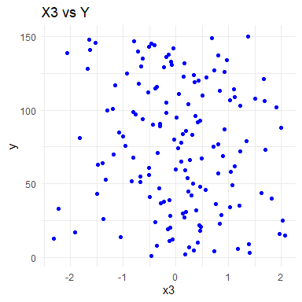
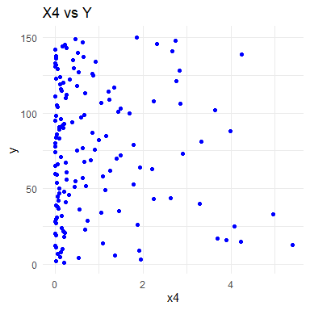
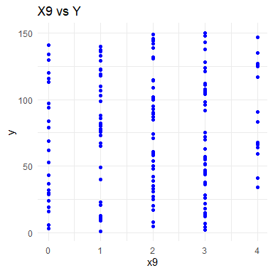
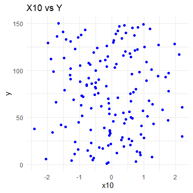
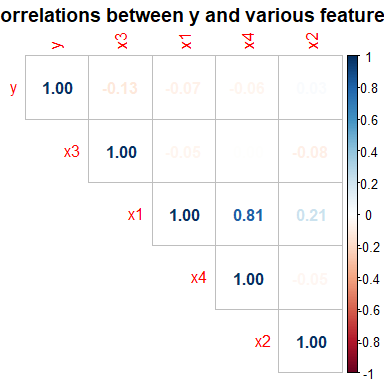

# Introduction {-}

This is an R Markdown report documenting my first homework assignment from my 
Machine Learning class at Emory University's Rollins School of Public Health in 
Spring 2019. The course was taught in Python and was originally submitted as a Jupyter Notebook. Since graduating I have learned 
and used R for data science projects much more frequently so I decided to go back 
and re-do my assignments in R with a few goals in mind. 

1. I don't think I got as much out of the class as I could have and I feel like a stronger basis in theory would improve my current practice. The class was also in Python and since I primarily use R now I want to learn to do these same tasks in R.

2. I would like to demonstrate basic skills one would learn in an academic machine learning class, how some experience using these skills in the workplace might improve upon them.

3. I hope that this series can serve as a very bare bones minimum of what a hiring manager should look for when a candidate submits a example code of machine learning or data analysis they have done. If a candidate is sending you an example of their code and it has warning (or error messages !) in it, let that be its own warning.

##  Practicing handling files {-}

The first assignment is about learning how to read in files and do basic exploratory visualizations like scatter plots, correlation plots, simple linear regression, and predicting new values from the data provided. 

The homework in the class was very practical and focused on the implementation of the theory learned in the class so these reports may not go into as much detail in writing out every thought someone doing this analysis may have. 

## Read in the prac1 dataset {-}

The prac1 dataset was provided without context so we did not know what y or any of the x variables represented. The point of the assignment was to practice uploading and working with sample data so this was fine.

This is not how you would want to start off any real-life analysis. You would begin analysis with a question about how you think your y variable is related to your x variables and you would choose an algorithm with which to address that question. 

Every machine learning algorithm is not appropriate for every question. Even if a program can be made to run without errors that does not mean the analysis done was appropriate or done correctly. If you do not understand why you are using a specific algorithm on a data set, don't use it. 


```r
prac_1 <- read_csv(files$prac1, show_col_types = FALSE) %>%
  clean_names() %>%
  select(c(x1,x2,x3,x4,x9,x10,y))
```

## Summary Statistics {-}

Next we were asked to provide summary statistics for quantitative variables.
These are typical steps in any data analysis project. 

Note that I have used
embedded variables throughout this summary so that in case the input data 
change, the summary paragraph will change to reflect the summary statistics
of that data. This information could also be summarized in a table but was requested in words.


```r
# values for summary paragraph
sum <- skim(prac_1)

std_err_y <- sum %>%
  filter(skim_variable == "y")
std_err_x1 <- sum %>%
  filter(skim_variable == "x1")
std_err_x2 <- sum %>%
  filter(skim_variable == "x2")
std_err_x3 <- sum %>%
  filter(skim_variable == "x3")
std_err_x4 <- sum %>%
  filter(skim_variable == "x4")
std_err_x9 <- sum %>%
  filter(skim_variable == "x9")
std_err_x10 <- sum %>%
  filter(skim_variable == "x10")

# summary tables

head(prac_1) %>%
  kbl(digits = 2, align = "l", 
      caption = "First several rows of 'prac 1", 
      booktabs = T) %>%
  kable_material_dark()
```

<table class=" lightable-material-dark" style='font-family: "Source Sans Pro", helvetica, sans-serif; margin-left: auto; margin-right: auto;'>
<caption>(\#tab:summary)First several rows of 'prac 1</caption>
 <thead>
  <tr>
   <th style="text-align:left;"> x1 </th>
   <th style="text-align:left;"> x2 </th>
   <th style="text-align:left;"> x3 </th>
   <th style="text-align:left;"> x4 </th>
   <th style="text-align:left;"> x9 </th>
   <th style="text-align:left;"> x10 </th>
   <th style="text-align:left;"> y </th>
  </tr>
 </thead>
<tbody>
  <tr>
   <td style="text-align:left;"> 1.50 </td>
   <td style="text-align:left;"> -0.34 </td>
   <td style="text-align:left;"> -0.46 </td>
   <td style="text-align:left;"> 0.21 </td>
   <td style="text-align:left;"> 1 </td>
   <td style="text-align:left;"> -0.15 </td>
   <td style="text-align:left;"> 1 </td>
  </tr>
  <tr>
   <td style="text-align:left;"> 0.63 </td>
   <td style="text-align:left;"> 0.52 </td>
   <td style="text-align:left;"> 0.17 </td>
   <td style="text-align:left;"> 0.03 </td>
   <td style="text-align:left;"> 3 </td>
   <td style="text-align:left;"> -0.10 </td>
   <td style="text-align:left;"> 2 </td>
  </tr>
  <tr>
   <td style="text-align:left;"> 5.20 </td>
   <td style="text-align:left;"> -0.77 </td>
   <td style="text-align:left;"> 1.40 </td>
   <td style="text-align:left;"> 1.95 </td>
   <td style="text-align:left;"> 0 </td>
   <td style="text-align:left;"> 0.76 </td>
   <td style="text-align:left;"> 3 </td>
  </tr>
  <tr>
   <td style="text-align:left;"> 2.20 </td>
   <td style="text-align:left;"> 0.38 </td>
   <td style="text-align:left;"> 0.73 </td>
   <td style="text-align:left;"> 0.53 </td>
   <td style="text-align:left;"> 3 </td>
   <td style="text-align:left;"> -1.24 </td>
   <td style="text-align:left;"> 4 </td>
  </tr>
  <tr>
   <td style="text-align:left;"> 0.72 </td>
   <td style="text-align:left;"> 0.03 </td>
   <td style="text-align:left;"> 0.34 </td>
   <td style="text-align:left;"> 0.11 </td>
   <td style="text-align:left;"> 2 </td>
   <td style="text-align:left;"> -0.59 </td>
   <td style="text-align:left;"> 5 </td>
  </tr>
  <tr>
   <td style="text-align:left;"> 1.60 </td>
   <td style="text-align:left;"> -0.86 </td>
   <td style="text-align:left;"> 1.17 </td>
   <td style="text-align:left;"> 1.37 </td>
   <td style="text-align:left;"> 0 </td>
   <td style="text-align:left;"> -2.04 </td>
   <td style="text-align:left;"> 6 </td>
  </tr>
</tbody>
</table>

The prac_1 dataset has 150 rows and 7 columns. All variables are 100% complete, with no missing values so all counts for all 
variables will be 150. 

The outcome or dependent variable "y" has a mean of 75.5, the standard deviation of 43.4, and a median of  75.5. The lowest value of "y" is 
1.0 and the highest value is 150.0.

The independent variable "x1" has a mean of 2.0, 
the standard deviation of 2.6, and a median of  1.4. The lowest value of "x1" is 
-2.1 and the highest value is 10.0.

The independent variable "x2" has a mean of -0.0, the standard deviation of 0.6, and a median of  0.0. The lowest value of "x2" is -1.0 and the highest value is 1.0.

The independent variable "x3" has a mean of 0.1, 
the standard deviation of 0.9, and a median of  0.1. The lowest value of "x3" is -2.3 and the highest value is 2.1.

The independent variable "x4" has a mean of 0.9, 
the standard deviation of 1.2, and a median of 0.4. The lowest value of "x4" is 0.0 and the highest value is 5.4.

The independent variable "x9" has a mean of 1.9, 
the standard deviation of 1.2, and a median of 2.0. The lowest value of "x9" is 0.0 and the highest value is 4.0.

The independent variable "x10" has a mean of -0.04, the standard deviation of 1.0, and a median of  -0.1. The lowest value of "x10" is -2.4 and the highest value is 2.2.

### Exploratory Data Analysis {-}

If you skip this step in real-life analysis to get to the modeling without actually knowing anything about your data, it is very likely (read: certain) you will analyze the data incorrectly and have misplaced confidence in your results.

##### Scatterplot of x1 - x10 vs y {-}

These are very basic, exploratory graphs since I am using them to check relationships between the x and y variables and they would not likely be 
considered a deliverable. Note that x9 and x10 are not included because these appeared to be categorical and a scatter plot would not be appropriate to asses a relationship with a numerical variable like y. 

As mentioned above in a real-life analysis you would 
have data where you suspect there to be a relationship between your y and x variables and you can check that visually with a scatter plot. Sometimes data may require transformations to properly capture the relationship since it may not be linear but that was beyond the scope of this assignment. 


```r
theme_set(theme_minimal())

prac_1 <- prac_1 %>%
     mutate_if(is.factor, as.numeric)

ggplot(prac_1, aes(x = x1, y = y)) +
    geom_point(color = c("blue")) +
  ggtitle("X1 vs Y")
```

<!-- -->

```r
ggplot(prac_1, aes(x = x2, y = y)) +
    geom_point(color = c("blue")) +
  ggtitle("X2 vs Y")
```

<!-- -->

```r
ggplot(prac_1, aes(x = x3, y = y)) +
    geom_point(color = c("blue")) +
  ggtitle("X3 vs Y")
```

<!-- -->

```r
ggplot(prac_1, aes(x = x4, y = y)) +
    geom_point(color = c("blue")) +
  ggtitle("X4 vs Y")
```

<!-- -->

```r
ggplot(prac_1, aes(x = x9, y = y)) +
    geom_point(color = c("blue")) +
  ggtitle("X9 vs Y")
```

<!-- -->

```r
ggplot(prac_1, aes(x = x10, y = y)) +
    geom_point(color = c("blue")) +
  ggtitle("X10 vs Y")
```

<!-- -->

Based on these scatter plots, the x variables do not appear to be correlated with the y variable. If I were using real data and I saw this kind of 
relationship between my x variables and y variables I would likely not use
any model to identify a relationship between them since there 
does not appear to be one. 

#### Correlation plot {-}

Another common exploratory tool to assess relationships between variables is a correlation plot. The closer the values are to 1 or -1, the stronger the relationship between the variables. Every variable will be 100% correlated with itself so you will see 1s in those boxes. 


```r
prac_1 %>%
  select(y, x1:x4) %>%
  cor %>%
 {.[order(abs(.[, 1]), decreasing = TRUE),
    order(abs(.[, 1]), decreasing = TRUE)]} %>%
  corrplot::corrplot(method = "number", type = "upper", mar = c(0, 0, 1.5, 0),
           title = "Correlations between y and various features")
```

<!-- -->

The results of the correlation matrix support my conclusion about the 
lack of relationship between the x variables and y variable. I do not expect a
linear model to find a relationship between y and any of these variables.

### Linear regression of x1-x4 and y {-}

Here we are working under the [assumptions of a linear model](https://bookdown.org/pingapang9/linear_models_bookdown/chap-assumptions.html) 
for the sake of simplicity. The original assignment did not go into detail on this 
but these are things you want to check before using a linear model on real life 
data. 

Often real-life data do not satisfy these assumptions and in those cases
it would not be appropriate to use a linear model to assess relationships between
variables.


```r
# set the engine
lm_model <- linear_reg() %>% 
  set_engine("lm")

# model formula, on all data as this is an example
lm_form_fit <- lm_model %>% 
   fit(y ~ x1 + x2 + x3 + x4, data = prac_1)

# summarize the results
model_res <-
  lm_form_fit %>%
  extract_fit_engine() %>% 
  summary() 

# save value for summary paragraph
r_sq <- model_res$r.squared 
r_sq <- round_tidy((r_sq * 100), 1)

# tidy the results
tidy(lm_form_fit) %>%
    kbl(digits = 1, 
        align = "l", 
        label = "Results from linear model y = x1+x2+x3+x4", 
        booktabs = T) %>%
  kable_material_dark()
```

<table class=" lightable-material-dark" style='font-family: "Source Sans Pro", helvetica, sans-serif; margin-left: auto; margin-right: auto;'>
 <thead>
  <tr>
   <th style="text-align:left;"> term </th>
   <th style="text-align:left;"> estimate </th>
   <th style="text-align:left;"> std.error </th>
   <th style="text-align:left;"> statistic </th>
   <th style="text-align:left;"> p.value </th>
  </tr>
 </thead>
<tbody>
  <tr>
   <td style="text-align:left;"> (Intercept) </td>
   <td style="text-align:left;"> 78.5 </td>
   <td style="text-align:left;"> 4.6 </td>
   <td style="text-align:left;"> 17.1 </td>
   <td style="text-align:left;"> 0.0 </td>
  </tr>
  <tr>
   <td style="text-align:left;"> x1 </td>
   <td style="text-align:left;"> -2.1 </td>
   <td style="text-align:left;"> 2.6 </td>
   <td style="text-align:left;"> -0.8 </td>
   <td style="text-align:left;"> 0.4 </td>
  </tr>
  <tr>
   <td style="text-align:left;"> x2 </td>
   <td style="text-align:left;"> 3.7 </td>
   <td style="text-align:left;"> 7.0 </td>
   <td style="text-align:left;"> 0.5 </td>
   <td style="text-align:left;"> 0.6 </td>
  </tr>
  <tr>
   <td style="text-align:left;"> x3 </td>
   <td style="text-align:left;"> -5.9 </td>
   <td style="text-align:left;"> 3.8 </td>
   <td style="text-align:left;"> -1.6 </td>
   <td style="text-align:left;"> 0.1 </td>
  </tr>
  <tr>
   <td style="text-align:left;"> x4 </td>
   <td style="text-align:left;"> 1.9 </td>
   <td style="text-align:left;"> 5.6 </td>
   <td style="text-align:left;"> 0.3 </td>
   <td style="text-align:left;"> 0.7 </td>
  </tr>
</tbody>
</table>

Based on an ordinary least squares regression (OLS), also called a simple
linear regression, x1 - x4 do not appear to be statistically significantly 
correlated with y at the 95% confidence limit. The model's R-squared value 
of 2.4% suggests that x1-x4 do a terrible job at predicting y. 
The correct interpretation of this would be that x1-x4 account for only 
2.4% of the variation seen in y. 

If we were to interpret these coefficients the correct interpretation would be 
that for every 1 point increase in x1, y would decrease approximately 2 points, 
for every 1 point increase in x2, y would increase approximately 4 points, for 
every 1 point increase in x3, y would decrease approximately 6 points, and for 
every 1 point increase in x4, y would increase approximately 2 points though 
none of these relationships appear to be statistically significant. 
P-values should not be relied upon in a vacuum and should be one part of 
determining if variables are related to an outcome.

#### Predicting new values {-}

When we use this model to predict new outcome estimates (y) we see that these 
lower and upper confidence intervals for these estimates are very wide, they vary between the -10s to the 100s. Without knowing anything else about the
source data these estimates alone would suggest to me that these predicted data would be worse than useless. 

How might a client react if you told them your company made
an estimated $\$ 100,000$  dollars in revenue annually but that it could vary as much as being $\$ 20,000$ in debt every year or having $\$ 1,000,000$ dollars in annual revenue? This is the level of certainty these results are giving us. 

Note that I have set a seed, an inconsequential string of digits, to ensure I will produce the same results each time I run this analysis. If you are using a machine learning algorithm it is critical that you set a seed for you and others to be able to reproduce your work each time you run an analysis.


```r
set.seed(22310)

prac_1_small <- prac_1 %>% 
  sample_n(50) %>%
  slice(1:5) 

prac_1_small %>%
  select(y) %>%
   bind_cols(predict(lm_form_fit, new_data = prac_1_small)) %>%
  bind_cols(predict(lm_form_fit, new_data = prac_1_small, type = "pred_int")) %>%
      kbl(digits = 1, 
        align = "l", 
        label = "Results from predicting new values for y = x1+x2+x3+x4", 
        booktabs = T) %>%
  kable_material_dark()
```

<table class=" lightable-material-dark" style='font-family: "Source Sans Pro", helvetica, sans-serif; margin-left: auto; margin-right: auto;'>
 <thead>
  <tr>
   <th style="text-align:left;"> y </th>
   <th style="text-align:left;"> .pred </th>
   <th style="text-align:left;"> .pred_lower </th>
   <th style="text-align:left;"> .pred_upper </th>
  </tr>
 </thead>
<tbody>
  <tr>
   <td style="text-align:left;"> 4 </td>
   <td style="text-align:left;"> 71.9 </td>
   <td style="text-align:left;"> -14.8 </td>
   <td style="text-align:left;"> 158.5 </td>
  </tr>
  <tr>
   <td style="text-align:left;"> 128 </td>
   <td style="text-align:left;"> 87.6 </td>
   <td style="text-align:left;"> -1.5 </td>
   <td style="text-align:left;"> 176.8 </td>
  </tr>
  <tr>
   <td style="text-align:left;"> 103 </td>
   <td style="text-align:left;"> 67.4 </td>
   <td style="text-align:left;"> -19.8 </td>
   <td style="text-align:left;"> 154.5 </td>
  </tr>
  <tr>
   <td style="text-align:left;"> 96 </td>
   <td style="text-align:left;"> 73.9 </td>
   <td style="text-align:left;"> -12.7 </td>
   <td style="text-align:left;"> 160.5 </td>
  </tr>
  <tr>
   <td style="text-align:left;"> 123 </td>
   <td style="text-align:left;"> 78.6 </td>
   <td style="text-align:left;"> -8.1 </td>
   <td style="text-align:left;"> 165.3 </td>
  </tr>
</tbody>
</table>
